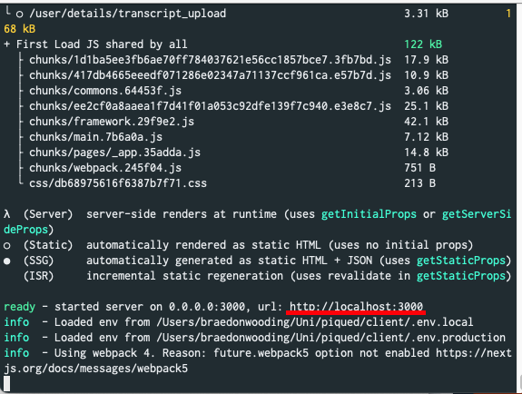

# Piqued - A simple messenger application

> Originally developed in a team of 5 for a uni project.

I've kept most of the original repos with a few exceptions, I've removed numerous app keys/certificates/initialisations

## Using

You can view a purely readonly version of the application here; [TODO](TODO).

> I've not yet setup a readonly version and may not, purely is based on my current time.

The login is; `readonly-user: "readonly-password"`

It's readonly because I don't trust the internet to not abuse this application (sadly). You can run a very easy version of this locally with very few dependencies (it supports sql-lite).

## Running Locally for Development

> No promise that this will work perfectly smooth, some scripts such as the scraper require an updated api key.

Running this locally has a few steps, and depends massively on how you want to run it, i.e. do you want to use a MSSQL server? Do you want to use another kind of SQL server (i.e. MySQL, Oracle, and so on). Do you want to simulate it via sqlite and so on.

Let's begin with the easiest steps first, we are going to set it up so that we have a locally running front end which is connected to our back end. This way we ensure that your front-end is all working fine before we run a local back-end.

- Git Clone the repository or download the zip
- Make sure you have `npm` installed, you can install it by following the given instructions here [https://www.npmjs.com/get-npm](https://www.npmjs.com/get-npm)
- `cd` into the client directory and run the following command (this will build the client and run it against a production back-end).

Unix: `npm install && npm run prod`

Windows: `npm install` followed by `npm run prod`

- Verify the app is working by going to the address [http://localhost:3000](http://localhost:3000), note it'll state this address as one of the final lines of output as shown in the image below [Figure \ref{fig:LocalApp_Addr}.] so if you have other stuff running it may be running on a different port.

Pat yourself on the back this is half the setup to get it fully running locally. Feel free to play around with the application it should work fully do note however that you are using a production back-end. Normally this wouldn't be recommended and you would add CORS restrictions to prevent this from happening (or require a cert or some app key) however, for an application intended for a uni project it simplifies installation.

Next step will be getting a back-end running!

- Open up a new terminal and go to the server directory (not the client one). I highly recommend a new terminal here.
- Make sure you have `python3` installed, while we technically only support python3.8 and above lower versions _should_ work (you need ATLEAST python3.4) but if you are having issues I recommend installing python 3.8 or above as per these instructions [https://www.python.org/downloads/](https://www.python.org/downloads/).
- Setup a python virtual environment via the commands `python3 -m venv .venv` (make sure you are in the server folder)
- Activate the virtual environment
  - Windows: `.venv\Scripts\activate.bat`
  - UNIX: `source .venv/bin/activate`
- Install all requirements for running the backend this is as simple as running (this can take quite a while, especially on rarer platforms) `python3 -m pip install -r requirements.txt`
- Run the back-end via the command
  - UNIX: `ENV_USE_SQLITE=1 python3 manage.py runserver`
  - WIN: `$env:ENV_USE_SQLITE=1; python3 manage.py runserver`
    note ANYTIME you want to run this you have to make sure you've activated the virtual environment. We'll begin by running it using sqlite and a DB we've already prepped with some nice beginning data.
- Once that's succeeded you just need to run the front-end in local mode which is as simple as running `npm run dev`. note: you need to run this from the client app and should use the other terminal (both have to be running).
- Verify the app is working by going to the address [http://localhost:3000](http://localhost:3000), note it'll state this address as one of the final lines of output as shown in the image below [Figure \ref{fig:LocalApp_Addr}.] so if you have other stuff running it may be running on a different port. The admin page will be at [http://localhost:8000](http://localhost:8000) (it'll state it after running python run server).

This however, won't cause rss feeds to update. To have this happen you'll have to run the rss feed updater manually.

`python3 feed_updater.py -u http://localhost:8000`

> NOTE: This will require setting up an api key with feedly.

We typically have a job setup on a VM to run this every minute (as discussed in detail in the overview).

Running the non sqlite isn't recommended due to requiring installation of ODBC driver, [https://docs.microsoft.com/en-us/sql/connect/odbc/download-odbc-driver-for-sql-server?view=sql-server-ver15](https://docs.microsoft.com/en-us/sql/connect/odbc/download-odbc-driver-for-sql-server?view=sql-server-ver15), however once installed just run the same command to start backend but use `ENV_USE_SQLITE=0` rather than 1.

However, note that you can ONLY run this if using the fully isolated sqlite setup, if you want to use SQL Server you'll have to disable the job that is setup on an Azure VM, the certificate is supplied in the repository (under server/PiquedVM_key.cer) and connecting to the VM is as simple as running

`ssh -i <path to cert> superadmin@20.188.209.63`

Then you'll have to just disable the cronjob by running

`sudo crontab -e`

And then by adding a # infront of the first line (the only cron job)

Note: there are many other ways to run/deploy this, such as the docker file in the main repository (under server). This can just be run as is and will act as a back-end (you'll have to build the image of course but is fully self enclosed).
